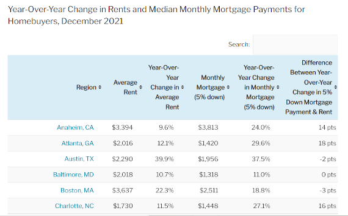

4/10/2022

## Is it more expensive to rent or own?

This markdown will scrape the data within the Redfin article [Rental
Market Tracker: Rents Rise 14% in December—Biggest Jump in Over Two
Years](https://www.redfin.com/news/redfin-rental-report-december-2021/).

I’m going to pull in the table that they have in the article that shows
average rent, mortgage, and associated annual increases.



## First things first - setting some variables

Set your working directory to wherever you’d like in the
`WORKINDIRECTORY` section.

``` r
wd1 = WORKINGDIRECTORY
setwd(wd1)
```

## Install and load any libraries

The `tidyverse` contains the `rvest` library which will be used to
scrape the data, while `dplyr` and `tidyr` will be used to
manipulate/transform data.

``` r
install.packages(c("tidyverse"))
```

Next, we want to load two libraries:

``` r
library(tidyverse)
library(rvest)
```

Although rvest is a component of the tidyverse, it doesn’t automatically
load with the library call `tidyverse`, as a result, you’ll need to load
it separately.

## Scraping the table

``` r
redfin <- read_html('https://www.redfin.com/news/redfin-rental-report-december-2021/')

tablebucket <- redfin %>%
  html_element(xpath = '//*[@id="tablepress-306"]') %>%
  html_table()
```

Ok, so we’ve downloaded the table and have it in a tibble format. Lets
go ahead and export it and load it into tableau.

``` r
write.csv(tablebucket, 'data/redfindata.csv', row.names = FALSE) 
```

Thats it!
